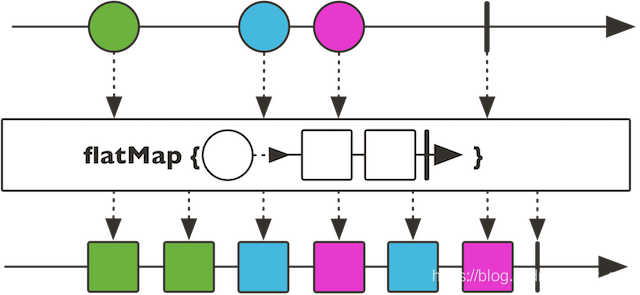

### 阻塞式编程方式

#### **Thread per Request模型**  


Servlet容器有专门的线程池用于管理HTTP请求，每个请求对应一个线程，该线程负责该请求的整
个生命周期（Thread per Request模型）。意味着应用仅能处理并发数为线程池大小的请求。可以配置
更大的线程池，但是线程占用内存（默认一个线程1MB），线程数越多，占用的内存越大。  

`maxThread`：tomcat的`maxThread`指的是处理业务的最大线程数，位于Connector组件的层次，在springboot中由`server.tomcat.max-threads`参数决定，默认是200

`acceptCount`：当前线程数达到maxThread的时候，等待队列的最大长度，默认为100


#### 传统编程方式的缺点


1 传统的命令式编程使用同步的请求/响应模式在服务之间通信，发出I/O请求的线程会阻塞等待I/O操作的完成.浪费资源

2 提高并发需要加大线程池大小

3 压垮客户端:服务A请求服务B的数据，如果数据量很大，超过了服务A能处理的程度，则导致A挂掉。  

### 异步编程（使用非阻塞式IO(NIO)）

接口A发起调用接口B的请求后就立即返回，而不用阻塞等待接口B响应，这样的好处是线程可以马上得到复用，接着处理下一个前端请求的任务，如果接口B处理完返回数据后，会有一个回调线程池处理真正的响应，即这种模式下我们的业务流程是http线程只处理请求，回调线程处理接口响应。
```Java
userService.getFavorites(userId, new Callback<List<String>>() { 
  public void onSuccess(List<String> list) { 
    if (list.isEmpty()) { 
      suggestionService.getSuggestions(new Callback<List<Favorite>>() {
        public void onSuccess(List<Favorite> list) { 
          UiUtils.submitOnUiThread(() -> { 
            list.stream()
                .limit(5)
                .forEach(uiList::show); 
            });
        }

        public void onError(Throwable error) { 
          UiUtils.errorPopup(error);
        }
      });
    } else {
      list.stream() 
          .limit(5)
          .forEach(favId -> favoriteService.getDetails(favId, 
            new Callback<Favorite>() {
              public void onSuccess(Favorite details) {
                UiUtils.submitOnUiThread(() -> uiList.show(details));
              }

              public void onError(Throwable error) {
                UiUtils.errorPopup(error);
              }
            }
          ));
    }
  }

  public void onError(Throwable error) {
    UiUtils.errorPopup(error);
  }
});

```
回调机制的最大问题是：Callback Hell（回调地狱）
大量使用 Callback 机制，使应该是先后的业务逻辑在代码形式上表现为层层嵌套，这会导致代码难以理解和维护


那么如何解决 Callback Hell 问题呢？ 响应式编程
```
userService.getFavorites(userId)  // 获取到集合数据流 1
           .flatMap(favoriteService::getDetails) // 获取喜欢的服务 2
           .switchIfEmpty(suggestionService.getSuggestions()) // 如果为空进行处理 suggestionService.getSuggestions() 3
           .take(5) // 只拿执行流中的5个 4 
           .publishOn(UiUtils.uiThreadScheduler()) // 发布到 UI 线程中进行处理 5
           .subscribe(uiList::show, UiUtils::errorPopup);  // 订阅处理结果 6
```


### 响应式编程

#### 什么是响应式编程

响应式编程（reactive programming）是一种基于数据流（data stream）和变化传递（propagation of change）的声明式（declarative）的编程范式

响应式编程是使用异步、事件驱动构建非阻塞式应用的，此类应用仅需要少量的线程用于横向扩展。  

借助背压技术，防止生产者压垮消费者。


#### 响应式编程特点

- 不用Thread per Request模型，使用少量线程即可处理大量的请求。
- 在执行I/O操作时不让线程等待。
- 简化并行调用。
- 支持背压，让客户端告诉服务端它可以处理多少负载  。


### Reactive Stream标准

反应式流（Reactive Stream） 就是反应式编程相关的规范，在 Java 平台上，由Netflix（开发了 RxJava）、TypeSafe（开发了 Scala、Akka）、Pivatol（开发了 Spring、Reactor）共同制定。
https://www.reactive-streams.org/

#### 响应式库有哪些
1. RxJava
2. Reactor
3. Akka

#### Java 9提供的Flow API 的响应式编程的接口规范，包含以下三个接口

1. Publisher：发布者，负责发布消息；
2. Subscriber：订阅者，负责订阅处理消息；
3. Subscription：订阅控制类，可用于发布者和订阅者之间通信；


Publisher

```
public static interface Publisher<T> {
    public void subscribe(Subscriber<? super T> subscriber);
}
```

Subscriber

```
public static interface Subscriber<T> {
   
    public void onSubscribe(Subscription subscription);

    public void onNext(T item);

    public void onError(Throwable throwable);

    public void onComplete();
}
```

Subscription

```
public static interface Subscription {
    public void request(long n);

    public void cancel();
}
```

#### 示例：

```
public class FlowDemo {
    public static void main(String[] args) throws Exception {
        // 1. 定义发布者, 发布的数据类型是 Integer
        // 直接使用jdk自带的SubmissionPublisher, 它实现了 Publisher 接口
        SubmissionPublisher<Integer> publisher = new SubmissionPublisher<>();

        // 2. 定义订阅者
        Flow.Subscriber<Integer> subscriber = new Flow.Subscriber<>() {

            private Flow.Subscription subscription;

            @Override
            public void onSubscribe(Flow.Subscription subscription) {
                // 保存订阅关系, 需要用它来给发布者响应
                this.subscription = subscription;

                // 请求一个数据
                this.subscription.request(1);
            }

            @Override
            public void onNext(Integer item) {
                // 接受到一个数据, 处理
                System.out.println("接受到数据: " + item);

                try {
                    TimeUnit.SECONDS.sleep(3);
                } catch (InterruptedException e) {
                    e.printStackTrace();
                }

                // 处理完调用request再请求一个数据
                this.subscription.request(1);

                // 或者 已经达到了目标, 调用cancel告诉发布者不再接受数据了
                // this.subscription.cancel();
            }

            @Override
            public void onError(Throwable throwable) {
                // 出现了异常(例如处理数据的时候产生了异常)
                throwable.printStackTrace();

                // 我们可以告诉发布者, 后面不接受数据了
                this.subscription.cancel();
            }

            @Override
            public void onComplete() {
                // 全部数据处理完了(发布者关闭了)
                System.out.println("处理完了!");
            }

        };

        // 3. 发布者和订阅者 建立订阅关系
        publisher.subscribe(subscriber);

        // 4. 生产数据, 并发布
        // 这里忽略数据生产过程
        for (int i = 0; i < 1000; i++) {
            System.out.println("生成数据:" + i);
            publisher.submit(i);
        }

        publisher.close();

        Thread.currentThread().join(1000);
        System.out.println();
    }

}
```


#### Reactor

Reactive Stream 是一套反应式编程的规范，但作为应用程序 API，应用程序肯定还是需要一个更高级、更丰富的功能 API 来编写异步逻辑。这就是 反应式库 所扮演的角色。

Reactor 框架是 Pivotal 基于 Reactive Programming 思想实现的。它符合 Reactive Streams 规范。它提供了Mono和Flux API 类型，通过一组与 ReactiveX 运算符词汇表一致的丰富运算符来处理 0…1 （） 和 0…N （）的数据序列。是一个用于 JVM 的完全非阻塞的响应式编程框架，具备高效的需求管理，可以很好的处理 “backpressure”。
Reactor 就是 Spring WebFlux 的首选 反应式库。

在上面的概念中，大家最重要是要记住 Flux 和 Mono 这两个 Reactor 的核心类：

**Mono：实现发布者 Publisher，并返回 0 或 1 个元素。**

**Flux：实现发布者 Publisher，并返回 N 个元素。**

**两个都是发布者 Publisher。**

#### Reactive Stream、Reactor 和 WebFlux 关系

Reactive Stream 是一套反应式编程 标准 和 规范；
Reactor 是基于 Reactive Stream 一套 反应式编程框架；
WebFlux 以 Reactor 为基础，实现 Web 领域的 反应式编程框架。

### Spring Webflux

Spring提供了两条并行的技术栈，一条是基于Servlet API的Spring MVC和Spring Data，另一个条是完整的响应式栈，包括Spring WebFlux和Spring Data’s reactive repositories。


Spring Framework 中包含的原始 Web 框架 Spring Web MVC 是专门为 Servlet API 和 Servlet 容器构建的。反应式堆栈 Web 框架 Spring WebFlux 是在 5.0 版的后期添加的。它是完全非阻塞的，
支持反应式流(Reactive Stream)背压，并在Netty，Undertow和Servlet 3.1 +容器等服务器上运行。


Spring WebFlux 是一个异步非阻塞式 IO 模型，通过少量的容器线程就可以支撑大量的并发访问。底层使用的是 Netty 容器，这点也和传统的 SpringMVC 不一样，SpringMVC 是基于 Servlet 的。


### WebFlux 中 MVC 接口的示例：
```Java
@GetMapping("/hello")
public Mono<String> hello() {
    return Mono.just("hello");
}
```
最大的变化就是返回值从 Object 所表示的一个对象变为 Mono<Object> 或 Flux<Object>
反应式要求整个链接都是响应式的，不能再使用以前的mybatis redis 
应当使用 spring-boot-starter-data-r2dbc、spring-boot-starter-data-redis-reactive


### 1. Mono和Flux的创建
```Java
Mono<String> helloWorld = Mono.just("Hello World");
Flux<String> fewWords = Flux.just("Hello", "World");
Flux<String> manyWords = Flux.fromIterable(words);
```
### 2. 处理 Mono 和 Flux（中间阶段）
中间阶段的 Mono 和 Flux 的方法主要有 filter、map、flatMap、then、zip、reduce、filter
传统的命令式编程
map


flatMap


filter


zip


```Java
Object result1 = doStep1(params);
Object result2 = doStep2(result1);
Object result3 = doStep3(result2);
```
对应的响应应式编程
```Java
Mono.just(params)
    .flatMap(v -> doStep1(v))
    .flatMap(v -> doStep2(v))
    .flatMap(v -> doStep3(v));
```
### 3. 消费 Mono 和 Flux（结束阶段）
直接消费的 Mono 或 Flux 的方式就是调用 subscribe() 方法。如果在 WebFlux 接口中开发，直接返回 Mono 或 Flux 即可。WebFlux 框架会完成最后的 Response 输出工作。

### 并发执行
```Java
Mono.zip(item1Mono, item2Mono).map(tuple -> {
    CustomType1 item1 = tuple.getT1();
    CustomType2 item2 = tuple.getT2();
    // Do merge
    return mergeResult;
});

```
**接口的响应时间并不会因为使用了 WebFlux 而缩短，服务端的处理结果还是得由 worker 线程处理完成之后再返回给前端。**
